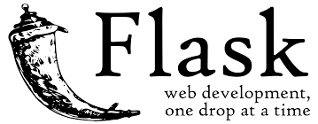
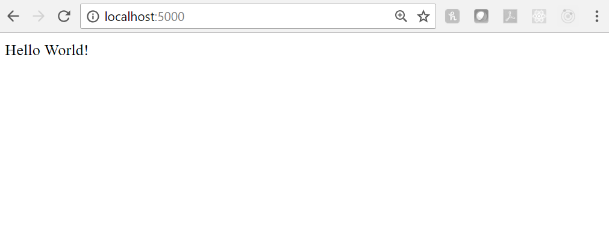
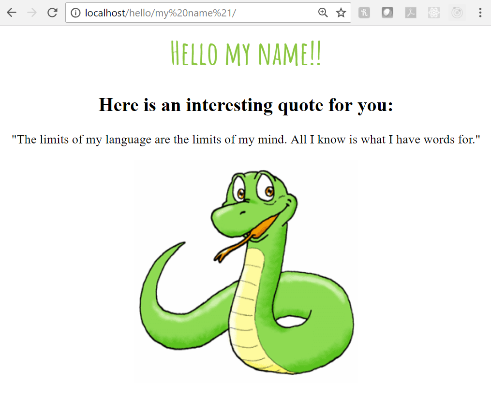
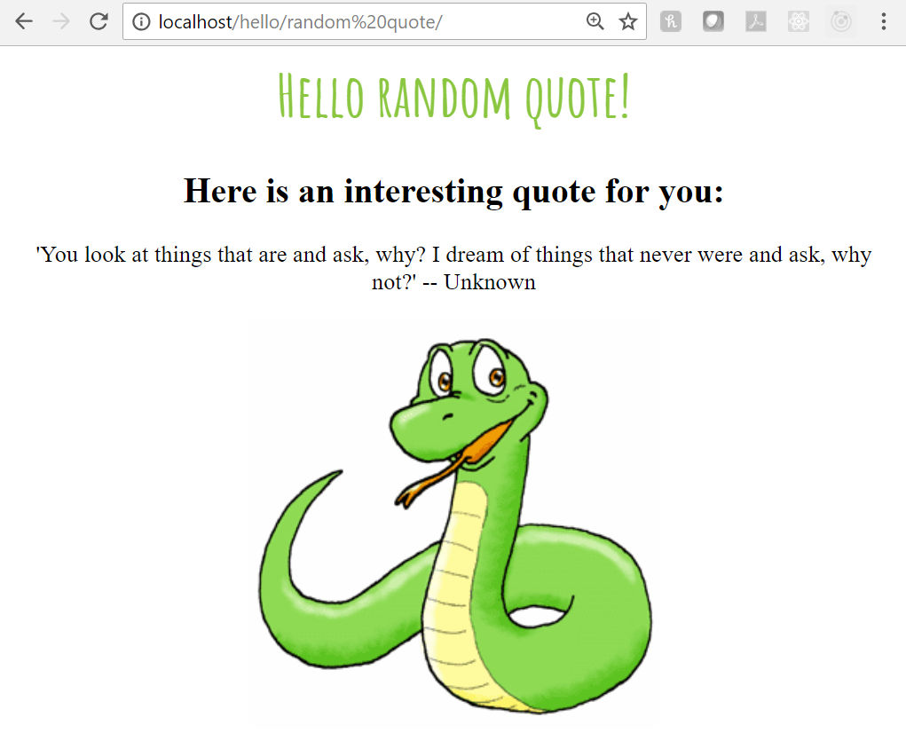

# CS52 Workshop:  Building a Flask Web App



**TODO:**
Brief motivation here as well as in presentation

## Overview

We're going to build a very simple web app with Python and HTML/CSS using a micro-framework called Flask. Here's an overview of what you're going to accomplish by the end of this workshop:

* [ ] Create a Flask web app using 7 lines of code!
* [ ] Add routes
* [ ] Use templates
* [ ] Make a web page with inspirational quotes

## Setup

Install Flask using the command below:

```
$ pip install Flask
```

That was easy, wasn't it? And it doesn't get harder than that!! Flask is great.

## Step by Step

### Step 1 - Hello World

Fork this repo.

Create a file called **hello.py** and copy the following code into the file:

```
from flask import Flask
app = Flask(__name__)

@app.route("/")
def hello():
    return "Hello World!"

if __name__ == "__main__":
    app.run()
```

Flask uses Python, so spacing/tabs/indents matter! Run your web app to make sure that everything's working:

```
$ python hello.py
```

Open http://localhost:5000/ in your web browser. It should look something like this:



Congratulations, you've created a web app using Flask in just 7 lines of code!

### Step 2 - Creating URL Routes

Routes are very simple to set up using Flask. We're going to be creating the following routes:

```
/hello
/hello/name/
```
Create a file called **app.py** and copy the following code into the file:

```
from flask import Flask
app = Flask(__name__)

@app.route("/")
def index():
    return "Flask App!"

@app.route("/hello")
def hello():
    return "Hello World!"

@app.route("/hello/<string:name>/")
def getMember(name):
    return "Hello " + name + "!"

if __name__ == "__main__":
    app.run()
```

Restart the application by running `python app.py` on your terminal. Try out these URLS in your browser:

* http://localhost:5000/
* http://localhost:5000/hello
* http://localhost:5000/hello/Tim

Your web browser should look something like this for the */hello/Tim* route:

TODO:


### Step 3 - Styling

We're going to separate out our Python code and HTML/CSS using templates. Make a directory called **templates**. Inside this folder, create a template called **test.html** and copy the following code into the file:

```



<div class="block1">
<h1>Hello {{name}}!</h1>
  <h2>Here is an interesting quote for you: </h2>
  <p>
"The limits of my language are the limits of my mind. All I know is what I have words for."
  </p>

</div>

```

Then, in the same folder, create a file called **layout.html** and copy the following code into the file:

```
<html>
<head>
    <title>Website</title>
<style>
@import url(http://fonts.googleapis.com/css?family=Amatic+SC:700);

body{
    text-align: center;    
}
h1{
    font-family: 'Amatic SC', cursive;
    font-weight: normal;
    color: #8ac640;
    font-size: 2.5em;
}

</style>

</head>
<body>
 

</body>
</html>
```

It's technically best practice to NOT have your HTML and CSS in the same file, but we'll just keep it like this for the sake of having one less file :sunglasses:.

Finally, adjust your **app.py** file so that the code looks like this:

```
from flask import Flask, flash, redirect, render_template, request, session, abort

app = Flask(__name__)

@app.route("/")
def index():
    return "Flask App!"

@app.route("/hello")
def hello_world():
    return "Hello World!"

@app.route("/hello/<string:name>/")
def hello(name):
    return render_template(
        'test.html',name=name)

if __name__ == "__main__":
    app.run(host='0.0.0.0', port=80)
```

Now run `python app.js` again and go to the URL http://localhost/hello/YOUR_NAME. It should look something like this:



### Step 4 - More Interesting Things

We're going to spice things up a little bit by varying the quotes displayed on the webpage! We'll need to adjust our render function so that we can choose a quote at random and then pass in multiple variables (name and quote) to be displayed.

So, in your **app.py** file,

1. Import randint by adding this to the top of your file:

```
from random import randint
```

2. Change the `hello(name)` function to read:

```
def hello(name):
    quotes = [ "'If people do not believe that mathematics is simple, it is only because they do not realize how complicated life is.' -- John Louis von Neumann ",
               "'Computer science is no more about computers than astronomy is about telescopes' --  Edsger Dijkstra ",
               "'To understand recursion you must first understand recursion..' -- Unknown",
               "'You look at things that are and ask, why? I dream of things that never were and ask, why not?' -- Unknown",
               "'Mathematics is the key and door to the sciences.' -- Galileo Galilei",
               "'Not everyone will understand your journey. That's fine. It's not their journey to make sense of. It's yours.' -- Unknown"  ]
    randomNumber = randint(0,len(quotes)-1)
    quote = quotes[randomNumber]

    return render_template(
        'test.html',**locals())
```

Then, slightly modify your **test.html** file so that it looks like this:

```



<div class="block1">
<h1>Hello {{name}}!</h1>
  <h2>Here is an interesting quote for you: </h2>
  <p>
{{quote}}
  </p>

</div>

```

Finally, run `python app.js` once last time. Each time you view http://localhost/hello/YOUR_NAME, you should see a different quote!



Annnnnd, you're done!!!

## Summary / What you Learned

* [x] Create a Flask web app using 7 lines of code!
* [x] Add routes
* [x] Use templates
* [x] Make a web page with inspirational quotes

## Resources

* [Tutorial that this workshop is based off of](https://pythonspot.com/flask-web-app-with-python/)
* [In-depth tutorial to make a CRUD app using Flask](http://flask.pocoo.org/docs/1.0/tutorial/)
* [Flask Mega-Tutorial](https://blog.miguelgrinberg.com/post/the-flask-mega-tutorial-part-i-hello-world)
